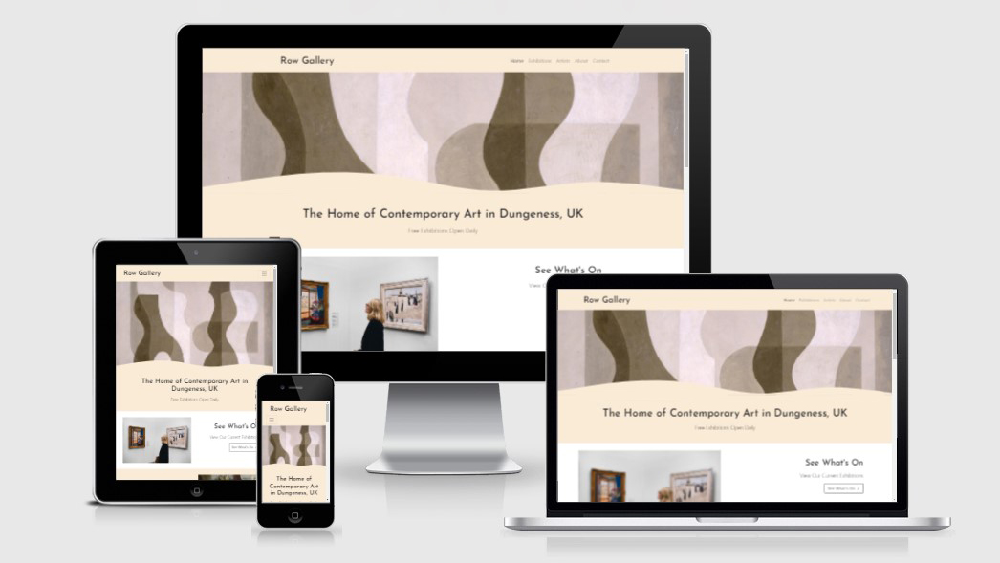
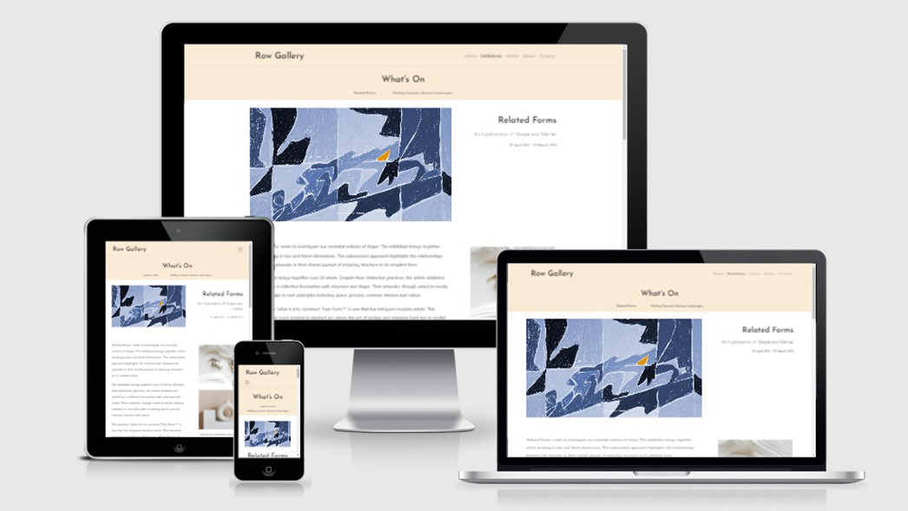
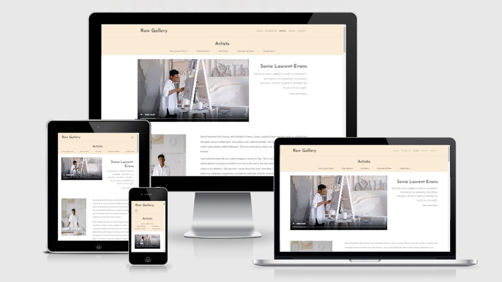

# Row Gallery Website 
## Milestone Project 1 

* The aim of this project is to build a static front-end website. The website is required to have at least 3 pages and be built using technologies I have learnt so far including HTML and CSS. The aim of the site is to provide value to both the user and the site owner through a clear presentation of data. 

* For this project, I have created a website for a fictitious art gallery called Row Gallery, located in Dungeness, UK. The focus of the design is to provide a good user experience and a structured layout of information. The website is responsive, so it is functional and looks good on any device screen size. 

* My website consists of a homepage to introduce the gallery and the main sections of the website. The site then has 4 pages, one with information about exhibitions, one with information about the gallery's artists, one with information about the gallery and visiting information and a contact page with a contact form.

## Live Project

[View the live project here.](https://isabella-mitchell.github.io/milestone-project-one/)

## Repository

[Find the project repository here](https://github.com/Isabella-Mitchell/milestone-project-one)

## Screenshots 

### Home Page Screenshot
<h2 align="center"></h2>

### Exhibitions Page Screenshot
<h2 align="center"></h2>

### Artists Page Screenshot
<h2 align="center"></h2>

# Table of Contents 

CONTENTS 

## User Experience (UX)

-   ### User stories

    -   #### Prospective Visitors

        *These are users considering or already planning a trip to Dungeness and would be interested in visiting the art gallery during their trip.*

        * As a prospective visitor I would like to see what is currently on at the art gallery. 
        * As a prospective visitor I would like to see when the gallery is open. 
        * As a prospective visitor I would like to see information about the art gallery, and why I should pay a visit during my trip. 
        * As a prospective visitor I would like to see the art gallery location and how to get there. 
        * As a prospective visitor I would like to see what else there is to do near the art gallery.
 
    -   #### Art Collectors 

        *These are users who have an interest in the works by the artists represented by the gallery and may wish to buy artworks.*
        
        * As an art collector I would like to see what artists are represented by the gallery. 
        * As an art collector I would like to see information about the artists and see examples of their work. 
        * As an art collector I would like to see information about the art gallery so that I know they are a respectable and trustworthy organisation. 
        * As an art collector I would like to be able to enquire about an artwork for sale. 
        * As an art collector I would like to be able to book a consultation either in person or virtually. 

    -   #### Business Owners
        *These are the owners of the gallery and of the website*
        
        * As the business owner, I want to feel that my business and brand are well represented by my online presence.
        * As the business owner, I want my website to be accessible and user-friendly on any device.
        * As the business owner, I want my website to feature links to my social media channels.
    

- ### Site Structure
    - The website has a Homepage, and then 4 further pages; Exhibitions, Artists, About and Contact.
    - Each page is featured the nav bar, allowing the user to easily navigate between them without needing to go back to the homepage.
    - On smaller device sizes, a 'Back To Top' button appears at the bottom of the screen
    - Page Links listed at the top of each page allow users to quickly jump to content.
    - Most pages feature buttons with 'call to actions' and internal links where appropriate, quickly directing them to relevant information on another page. E.g. you can access the About page for visiting information from the Exhbitions page.
    - The Footer remains consistant on each page.

- ### Wireframes

    [View my wireframes in PDF form here.](wireframes/wireframes.pdf)

## Design

### Colour Scheme

A simple and refined colour scheme has been used. The pale backgrounds of the website mimic the pale walls of the gallery space, so that the images take centre stage. 

I used the (Material Design Colour Tool)[https://material.io/resources/color/#!/?view.left=0&view.right=0] to decide the footer colour. The footer colour is inkeeping with the palette yet distinguishes this section from the others on the page. 

### Typography

Headings are in Josefin Sans and normal text is in Lato. Josefin Sans is a striking font which adds character to the website. Lato is a clean and easily readable font frequently used for websites and applications. Sans serif is the fallback font in case the font can not be imported into the site correctly.

### Imagery

Imagery is very important feature of the website, as the website needs to appeal visually to users and represent the gallery in a good light. 

The pages feature different image layouts, due to the type of images that need to be displayed. I researched art gallery websites including Pace Gallery and Arusha Gallery to see the types of content that they typically display on their websites. I incorporated the following into my website:
- Image Slideshows in landscape orientation on the Exhibition Page
- Image captions on the Exhibitions Page
- Artist Portraits on the Artist page

Consistant image ratios have been used to bring a harmony to the site across different page layouts.
- include 16:9 and 3:4.

## Features

Note: Deciding to keep long scroll pages to reduce number of clicks (and hierarchacal navigation) Though conscious that mobile and tablet are long. To investigate back to top/ sticky nav.

## Technologies Used

## Testing

## Deployment

## Credits

Notes coding 22/03/22 - 22/03/22

Spent a while picking fonts - still not convinced on Lato
Still to confirm secondary colour - 
Spent a while doing layout - to look more into flex - bugs like making things go to right
Stacking guide -  https://bootstrapcreative.com/bootstrap-push-pull-column-ordering-tutorial
Edit images first - makes life easier
reffered to oslo hotel project
media queries to make text center on mobile

Tool used: https://www.softr.io/tools/svg-wave-generator
Bootcamp documentation

Bugs
Images to fit in div - ended up giving up on relative/ absolute - I was confusing myself
Nav - get to stick right
adding justify-right to right hand image
Added padding to section-row, make spacing fit better.

Changes in design
Might keep copy high - as suggested by mentor.
Was looking for CSS shapes - found the wave tool and used a SVG

25.03

Added Footer
Made buttons
Improved homepage code
Picked images
Fewer bugs :)
Created exhibiton page

Added in hr header + footer colour - better ux

check heading/ h2/ h1 on page

change class names 'home'
make better button rules

Completed Froggy flex - https://flexboxfroggy.com/
bootstrap docs

27.03.22

Made artists page - contined updating spacing/ added containers

28.03

Made visit and started about page 

To do
finish about page
make contact page
neaten code
Fill with content.

Bugs
Nav move - resolved - something to do with scroll bar appearing/ not appearing.
Buttons not flush
How to get here spacing
check all divs and indentation
buttons as links

31.03.

Contact page
Fixed jumbatron

Questions
Video
Slideshow
UX
Using bootstrap classes/ css