# Row Gallery Website 
## Milestone Project 1 - Static Front-End Website

* Row Gallery is a contemporary art gallery located in Dungeness, UK. The aim of the Row Gallery website is to appeal to prospective gallery visitors and clients. The website is designed to be responsive so that it is user-friendly and looks appealing on any device.

* This is my Milestone Project 1 submission for Code Institute's Diploma in Web Application Development course. My website features five pages and is built using technologies that I have learnt including HTML and CSS.

## Live Project

[View the live project here.](https://isabella-mitchell.github.io/milestone-project-one/)

## Repository

[Find the project repository here](https://github.com/Isabella-Mitchell/milestone-project-one)

## Screenshots 

### Home Page Screenshot
<h2 align="center">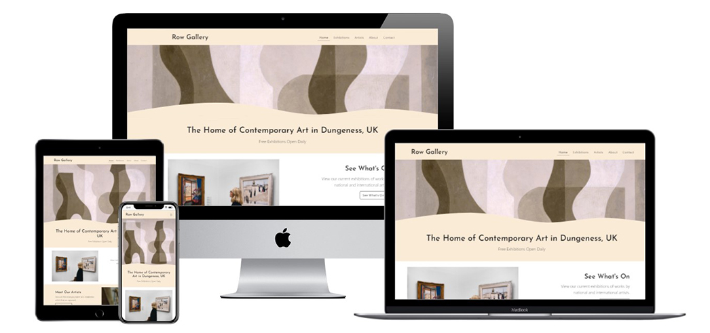</h2>

### Exhibitions Page Screenshot
<h2 align="center">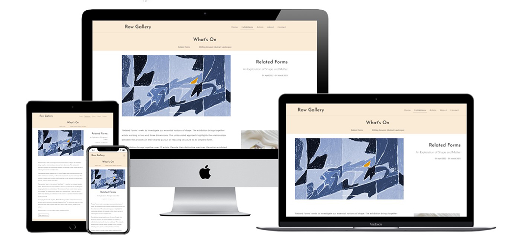</h2>

### Artists Page Screenshot
<h2 align="center">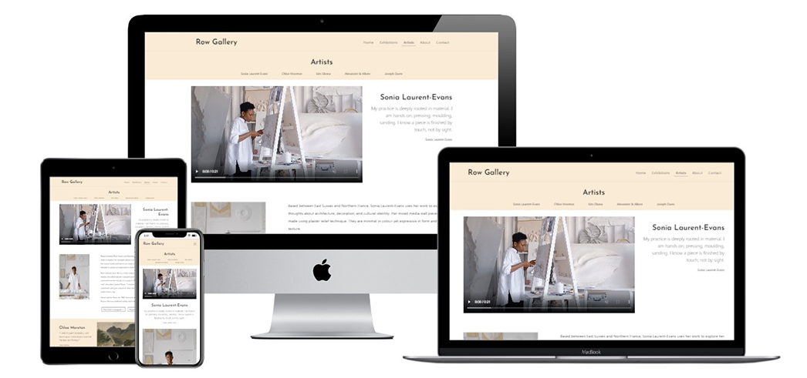</h2>

# Table of Contents 

## Contents
- [User experience](#user-experience)
  * [User Stories](#user-stories)
    + [Prospective visitors](#prospective-visitors)
    + [Art Collectors](#art-collectors)
    + [Business Owners](#business-owners)
- [Design](#design)
  + [Colour Scheme](#colour-scheme)
  + [Typography](#typography)
  + [Imagery](#imagery)
  + [Icons](#icons)
- [Structre](#structure)
  + [Information Architecture](#information-architecture)
  + [Navigation Bar](#navigation-bar)
  + [Back To Top Button](#back-to-top-button)
  + [Buttons](#buttons)
  + [Page Heading & Sub Navigations](#page-heading-and-sub-navigations)
  + [Footer](#footer)
- [Wireframes](#wireframes)
- [Features](#features)
  + [Current Features](#current-features)
  + [Future Features](#future-features)
- [Technologies used](#technologies-used)
  + [Languages Used](#languages-used)
  + [Frameworks Libraries and Programs](#frameworks-libraries-and-programs)
- [Testing](#testing)
- [Deployment](#deployment)
  + [GitHub Pages](#gitub-pages)
  + [Forking the GitHub Repository](#forking-the-github-repository)
  + [Making a Local Clone](#making-a-local-clone)
- [Credits](#credits)
  + [Code](#code)
  + [Media](#media)
  + [Content.](#content)
  + [Acknowledgements](#acknowledgements)

# User Experience (UX)


## User stories

### Prospective Visitors

*These are users considering or already planning a trip to Dungeness and would be interested in visiting the art gallery during their trip.*

* As a prospective visitor I would like to see what is currently on at the art gallery. 
* As a prospective visitor I would like to see information to help me plan my visit to the gallery, including opening hours, location and directions.
* As a prospective visitor I would like to see what amenities are near by to the art gallery.
* As a prospective visitor I would like to be able to contact the gallery if I have any questions about my visit.

### Art Collectors 

*These are users who have an interest in the works by the artists represented by the gallery and may wish to buy artworks.*

* As an art collector I would like to see what artists are represented by the gallery, I would like to read information about them and see examples of their work. 
* As an art collector I would like to see information about the art gallery so that I know they are a respectable and trustworthy organisation. 
* As an art collector I would like to be able to enquire about an artwork for sale. 
* As an art collector I would like to be able to book a consultation either in person or virtually. 

### Business Owners
*These are the owners of the gallery and of the website*

* As the business owner, I want to feel that my business and brand are well represented by my online presence.
* As the business owner, I want my website to be accessible and user-friendly on any device.
* As the business owner, I want my website to feature links to my social media channels.

    
## Design

### Colour Scheme
<h2 align="center">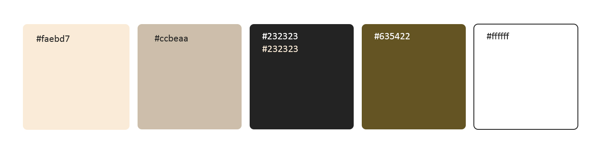</h2>

- A simple and refined colour scheme has been used. The pale backgrounds of the website mimic the pale walls of the gallery space, so that the images take centre stage. 

- The footer colour is in keeping with the palette yet distinguishes this section from the others on the page. 

- I used the [Material Design Colour Tool](https://material.io/resources/color/#!/?view.left=0&view.right=0) to decide on colour choices. 

### Typography

- Headings are in Josefin Sans and normal text is in Lato. Josefin Sans is a striking font which adds character to the website. Lato is a clean and easily readable font frequently used for websites and applications. Sans serif is the fallback font in case the font can not be imported into the site correctly.

### Imagery

- Imagery is a very important feature of the website, as the website needs to appeal visually to users and represent the gallery in a good light. 

- The pages feature slightly different image layouts, due to the type of images that need to be displayed. I researched art gallery websites including [Pace Gallery](https://www.pacegallery.com/) and [Arusha Gallery](https://www.arushagallery.com/) to see the types of content that they typically display on their websites. I incorporated the following into my website:
    - Image Slideshows in landscape orientation on the Exhibition Page
    - Image captions on the Exhibitions Page
    - Artist Portraits on the Artist page

- Consistent aspect ratios have been used to bring visual harmony to the site across different page layouts.
    - An aspect ratio of 16:9 has been used for the lead images on the Exhibition Page and Artist Page  
    - An aspect ratio of 3:2 has been used for the Homepage section images and the About Page images
    - An aspect ratio of 2:3 has been used for the Artist Page portraits.
    - A near-square aspect ratio has been used on the Exhibition Page for images that do not suit the aspect ratio of the Image Carousel.

### Icons
- I used icons from Font Awesome to encourage users to click on buttons and to add clear visual indicators to sections on the About page.

## Structure
### Information Architecture
- The website has a Homepage, and then 4 further pages; Exhibitions, Artists, About and Contact.
    - Homepage - Landing page with brief descriptions and links out to the other pages.
    - Exhibitions - Provides information (images and text) about 2 exhibitions
    - Artists - Provides information (images and text) about 5 artists
    - About - Provides information about the gallery plus visiting information including a map and directions
    - Contact - Provides a contact form
- Most pages feature buttons with 'call to actions' and internal links where appropriate, quickly directing them to relevant information on another page. For example, you can access the About page for visiting information from the Exhibitions page. This saves repeating information, and helps keep the website clean and concise.
- I decided  to keep long scroll pages rather than introduce further landing pages to reduce the number of clicks the user needs to make to find information.

### Navigation Bar
- Each page is featured the navbar, allowing the user to easily navigate between them without needing to go back to the homepage.
- The Navigation bar appears as a horizontal list on desktop, and a vertical drop down menu on mobile.
- The Navbar is not sticky, this means that the user can see more images and text on their screen.
- I have used the Bootstrap Navigation component. I have overridden the default opacity because, when I tested the website using Chrome Lighthouse, the colour contrast was deemed insufficient.
- For this reason, I have also added an underline to the 'active' page and to the hover state of non-active pages.

<h2 align="center">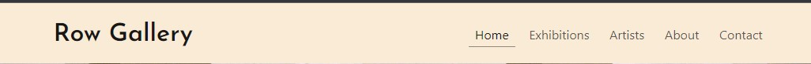</h2>
<h2 align="center">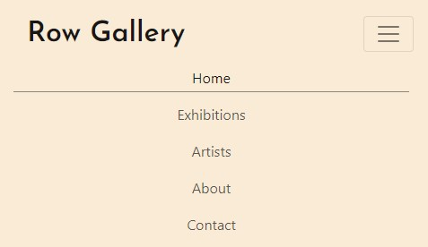</h2>

### Back To Top Button
- Pages with a lot of content feature a 'Back To Top' button. This appears at the bottom of the page on all screen sizes and saves the user needing to scroll back up to the Navigation Bar.
- The button features an 'up' arrow, to make it clear that it will quickly send users back to the top of the page.
<h2 align="center">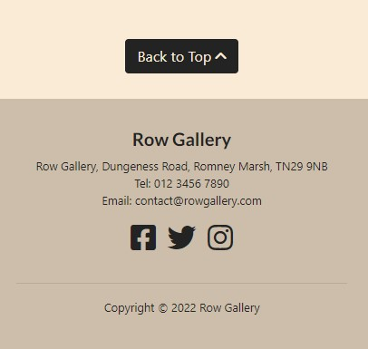</h2>

### Buttons
- Buttons are consistent in design across the site. The colour of the button depends on the background colour.
- Buttons feature a right arrow to encourage them to click and be taken to a new page.
- Buttons change colour when hovered over. The button text is legible both in its normal and hover state.
- I have used Bootstrap Button classes, which I have customised in the CSS.
<h2 align="center">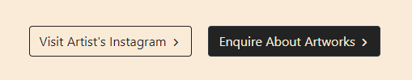</h2>
<h2 align="center">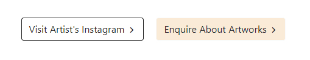</h2>

### Page Heading and Sub Navigations
- All pages other than the homepage feature a Page Heading.
- The Exhibitions, Artists and About pages feature a sub-navigation. These use ID names to allow website users to quickly jump to content.
- This means that users can quickly find the section they are looking for, without needing to click through another page.
- An underline appears underneath a link when it is hovered over. This further emphasises that this is a clickable link, and mirrors the behaviour of the main navigation bar.
- Aria-Labels have been used to make their purpose clear to Screen Readers.
<h2 align="center">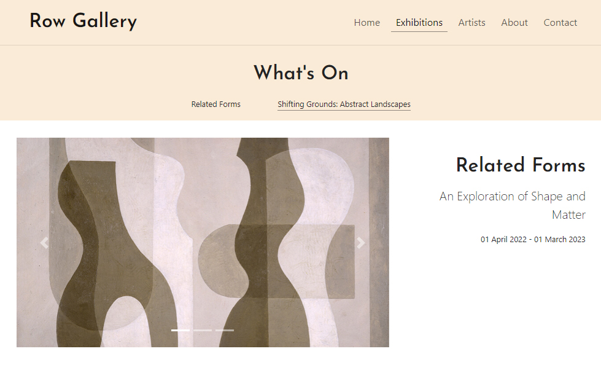</h2>

### Footer
- The Footer includes the Gallery's address, phone number, email address and social media links.
- The phone number and email address are tel: and mailto: links respectively.
- Social Media links open in a new page.
- The Footer remains consistent on each page.
- The social media links code was originally sourced from Code Institute's Bootstrap CV project.
<h2 align="center">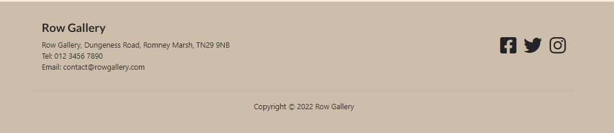</h2>
<h2 align="center">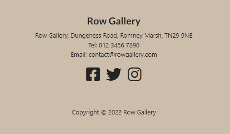</h2>

## Wireframes
- [View my wireframes in PDF form here.](wireframes/wireframes.pdf)

# Features

## Current Features

### Responsive on all device sizes
- By using mobile first design I have created a website that is fully responsive on all screen sizes.
- I have used the Bootstrap grid system and Flex classes to adjust the layout based on the device screen size. This allows the images and texts to look good and be easy to read.

### Interactive elements
- Videos on the Artists Page feature controls so that the user can choose to play and pause them.
- Image Carousels on the Exhibitions Page feature forward and back buttons that the user can use to control the images. It also includes an indicator so the user can see what slide they are on.
- A Google map iFrame on the About Page show users the location of the hotel.
- The Navbar turns into a drop-down menu on smaller devices.
- CSS transitions have been used on the navbar, page sub-navigations, buttons and social media icons.

## Future Features

### Events
- There could be an events section with a booking form, allowing users to book tickets for upcoming events.

### Past Exhibitions
- There could be an archive of past exhibitions

### E-Commerce
- There could be an online shop allowing users to buy art online.

# Technologies Used

## Languages Used

- [HTML5](https://en.wikipedia.org/wiki/HTML5)

- [CSS3](https://en.wikipedia.org/wiki/CSS)

## Frameworks Libraries and Programs

- [Bootstrap 4](https://getbootstrap.com/) 
  - I used bootstrap throughout the site to make it responsive. The website uses Bootstrap's Containers, Grid System and Flexbox and Button classes. I sourced code from the Bootstrap documentation when building the Navbar, Carousel, Buttons and Contact Form, 
  
- [Google Fonts](https://fonts.google.com/)
  - Two fonts were imported from google fonts. Josefin Sans for the headings, and Lato for the other text.
  
- [Font awesome](https://fontawesome.com/)
  - I used icons from font awesome to visually distinguish sections of the text and on buttons.

- [Git](https://git-scm.com/)
  - Git was used as a version control in the terminal.

- [Github](https://github.com/)
  - Github was used to create and store the project repository.

- [Gitpod](https://gitpod.io/)
  - Gitpod was used to create my files and where I wrote the code.

- [jQuery](https://jquery.com/)
  - jQuery came with Bootstrap to make the navbar responsive.

- [Balsamiq](https://balsamiq.com/)
  - Balsamiq was used to create Wireframes for the project during the initial planning stage.

- [Techsini](https://techsini.com/multi-mockup/)
  - Techsini was used to help check responsiveness and take screenshots of the page at different screen sizes.

- [SVG Wave Generator](https://www.softr.io/tools/svg-wave-generator)
  - Softr's SVG Wave Generator was used to make the wave image which sits on top of the Jumbotron.

- [Material Design Colour Tool](https://material.io/resources/color/#!/?view.left=0&view.right=0)
  - Material Design's Colour Tool was used to help decide on the colour palette of the website.

- [Adobe Photoshop](https://www.adobe.com/ie/products/photoshop.html)
  - Photoshop was used to resize and edit images for the website.

- [TinyPNG](https://tinypng.com/)
  - TinyPNG was used to compress images for a faster loading time.

- [WebFormatter](https://webformatter.com/html)
  - WebFormatter was used to help beautify the code.

- [Google Chrome Dev Tools](https://developer.chrome.com/docs/devtools/)
  - Google Chrome's Dev Tools were used while building the project to test responsiveness and for debugging.

- [Pexels](https://www.pexels.com/)
  - Pexels was used to source imagery for the website.

- [Unsplash](https://unsplash.com/)
  - Unsplash was used to source imagery for the website.

- [Flexbox Froggy](https://flexboxfroggy.com/)
  - I completed Flexbox Froggy during the initial build stages of the website to become more familiar with Flexbox.

- [Aspect Ratio Calculator](https://aspectratiocalculator.com)
  - Aspect Ratio Calculator was used to help me decide on the dimensions of images.

# Testing
- Please refer [here](TESTING.md) for more information on testing of the Row Gallery website.

# Deployment

## GitHub Pages

The project was deployed to GitHub Pages using these steps:

1. Log in to GitHub and go to the [GitHub Repository](https://github.com/Isabella-Mitchell/milestone-project-one)
2. Locate the Navbar at the top of the Repository (not top of page). Click the Settings tab.
3. Locate the Navbar on the left hand side of the page. Click the "Pages" section (under 'Code and automation').
4. Under "Source", click the dropdown called "None" and select "main". Click save.
5. The page will automatically refresh.
6. A notification will appear at the top of the page with the [link](https://isabella-mitchell.github.io/milestone-project-one/index.html) to the deployed site. You can return to this GitHub Pages section to access the link.

## Forking the GitHub Repository

Forks are used to propose changes to someone else's project or to use someone else's project as a starting point for your own idea. By forking the GitHub Repository you make a copy of the original repository on our GitHub account to view and/or make changes without affecting the original repository.

To Fork a Github Repository:

1. Log in to GitHub and go to the [GitHub Repository](https://github.com/Isabella-Mitchell/milestone-project-one)
2. Locate the Fork button in the top-right corner of the page, click Fork.
3. You should now have a copy of the original repository in your GitHub account.

## Making a Local Clone

You will now have a fork of the repository, but you don't have the files in that repository locally on your computer.

To make a local clone:

1. Log in to GitHub and go to the [GitHub Repository](https://github.com/Isabella-Mitchell/milestone-project-one)
2. Above the list of files, click  Code.
3. To clone the repository using HTTPS, under "Clone with HTTPS", click the 'Copy' icon. To clone the repository using an SSH key, including a certificate issued by your organization's SSH certificate authority, click Use SSH, then click the 'Copy' icon. To clone a repository using GitHub CLI, click Use GitHub CLI, then click the 'Copy' icon.
4. Open Git Bash.
5. Change the current working directory to the location where you want the cloned directory.
6. Type git clone, and then paste the URL you copied earlier. It will look like this, with your GitHub AE username instead of YOUR-USERNAME:

```
$ git clone https://github.com/YOUR-USERNAME/YOUR-REPOSITORY
```

7. Press Enter. Your local clone will be created.

```
$ git clone https://github.com/YOUR-USERNAME/YOUR-REPOSITORY
> Cloning into `milestone-project-one`...
> remote: Counting objects: 10, done.
> remote: Compressing objects: 100% (8/8), done.
> remove: Total 10 (delta 1), reused 10 (delta 1)
> Unpacking objects: 100% (10/10), done.
```

Click [Here](https://docs.github.com/en/github-ae@latest/get-started/quickstart/fork-a-repo) for the GitHub quick start guide with images and more detailed explanations of the above process.

# Credits

## Code

-   [Bootstrap4](https://getbootstrap.com/docs/4.4/getting-started/introduction/): Bootstrap Library was used throughout the project mainly to make site responsive using the Bootstrap Grid System and Flexbox. I sourced code from the Bootstrap documentation when building the Navbar, Carousel, Buttons and Contact Form. 

-   [Code Institute](https://codeinstitute.net/): I referred to lessons and source code from Code Institute's Web Application Development course. I sourced code for the footer social icons from the CV Project, and referred to the code from the Coders Coffee House project for the Google Maps iFrame.

## Content

-   I wrote all the content for the website. The gallery, exhibitions and artists are fictitious, I referred to the following sources for inspiration: 
    - [Tate](https://www.tate.org.uk) - for inspiration about artists, exhibitions and gallery website features.
    - [Whitecube](https://whitecube.com/) - for inspiration about artists and exhibitions.
    - [Pace Gallery](https://www.pacegallery.com) - for inspiration about artists, exhibitions and gallery website features.
    - [Camden Arts Centre](https://camdenartcentre.org/) - for inspiration about artists, exhibitions and gallery website features.
    - [Blue Shop Cottage](https://www.blueshopcottage.com/) - for inspiration about artists, exhibitions and gallery website features.
    - [Arusha Gallery](https://www.arushagallery.com/) - for inspiration about artists, exhibitions and gallery website features.
    - [RSPB Dungeness](https://www.rspb.org.uk/reserves-and-events/reserves-a-z/dungeness/) - for directions to Dungeness and things to do
    - [Dungeness Station](https://www.rhdr.org.uk/stations/dungeness-station/) - for directions to Dungeness and things to do
    - [Time Out Magazine Article](https://www.timeout.com/kent/things-to-do/best-things-to-do-in-dungeness) - for inspiration about things to Dungeness

## Media

-   All Images were sourced from open source websites [Pexels](https://www.pexels.com/) and [Unsplash](https://unsplash.com/). I'd like to say a particular thank you to:
    - [Anna Shvets](https://www.pexels.com/@shvetsa/) - For pictures of artists
    - [Greta Hoffman](https://www.pexels.com/@shvetsa/) - For pictures of artists
    - [James Hollingworth](https://unsplash.com/@jameshollingworth) - For pictures of Dungeness
    - [Birmingham Museums Trust](https://unsplash.com/@birminghammuseumstrust) - For pictures of artworks


## Acknowledgements

- Thank you to my Mentor Akshat Garg for helpful feedback, industry insights and recommended tools.

- Thank you to fellow Code Institute students/ alumni Harry Dhillon and Chelsea Williams for participating in the peer code review.

- Thank you to the Code Institute London Community for their encouragement and technical support - with special mention to Harry Dhillon for his continuous support.

- Thank you to the tutors and staff at Code Institute for their support.

Row Gallery is fictitious. This website is purely for the sake of the developer's portfolio and not for public consumption.

Isabella Mitchell, 2022.