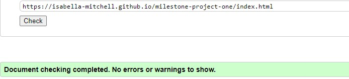
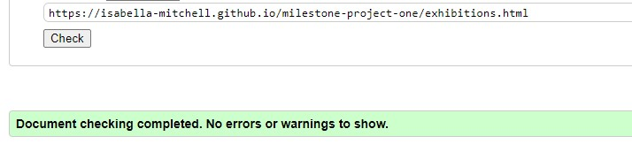
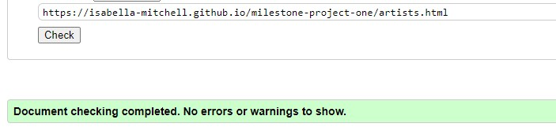
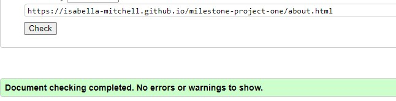
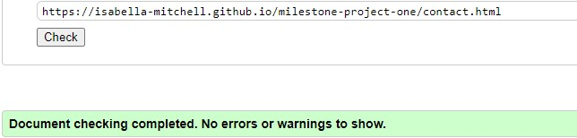
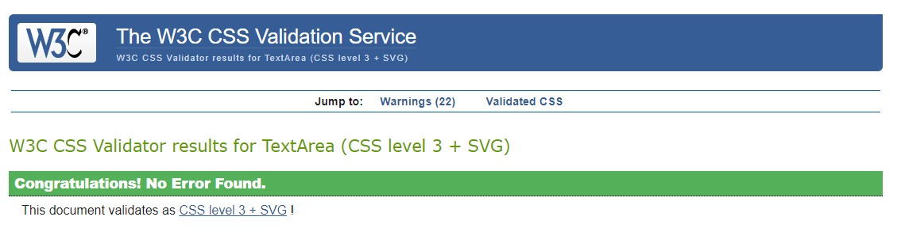
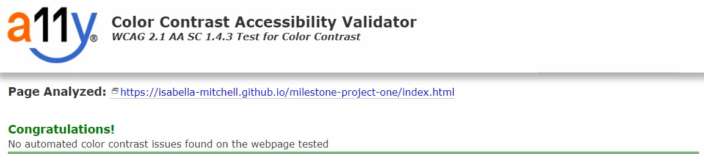

# Testing

The Row Gallery website has been tested using the following methods:
Code Validation
- W3C HTML Validator
- W3C CSS Validator
Lighthouse
A11y Color Contrast Accessibility Checker
Browser Compatibility
Responsiveness
Testing User Stories
Peer Review
Bugs
- Resolved
- Unresolved

# Code Validation

## W3C HTML Validator

The Row Gallery website passed all tests using the W3C HTML Validator tool

### Home Page
<h2 align="center"></h2>

### Exhibitions Page
<h2 align="center"></h2>

### Artists Page
<h2 align="center"></h2>

### About Page
<h2 align="center"></h2>

### Contact Page
<h2 align="center"></h2>

## W3C CSS Validator

The Row Gallery website passed all tests using the W3C CSS Validator tool
<h2 align="center"></h2>

# Lighthouse

I used the Lighthouse reports in Google Developer Tools to examine the pages of the website for the following
- Performace
- Accessibility
- Best Practices 
- SEO

All Pages performed well (scored 97 and above) in:
- Performance, Accessibility, Best Practices and SEO on Desktop
- Accessibility, Best Practices and SEO on Mobile

Some Pages did not perform as well (scored 85 and above) in:
- Performance on mobile

Lighthouse recommends saving images in next-gen formats and eliminating render-blocking resources to improve performance on mobile.

# A11y Color Contrast Accessibility Checker

All website pages were testing using the A11y Color Contrast Accessibility Checker and no automated color contrast issues found.

<h2 align="center"></h2>

# Browser Compatibility

The site was tested in Google Chrome, Microsoft Edge and Mozilla Firefox on desktop.

The site was tested in Google Chrome and Safari on mobile and tablet.

No issues arose during browser testing. CSS transitions worked on all browsers tested. 

Appearance, functionality and responsiveness were largely consistent across browsers and devices. Exceptions include:
- Image stretching on Ipad (see Resolved Bugs)
- The Lato font apperance changes quite a lot on mobile and ipad compared to desktop. I researched this and found a lot of people experienced this. However I am still happy with the font's appearance.

# Responsiveness

Responsivity tests were carried out using Google Chrome DevTools. Device screen sizes covered include:
- iPhone SE
- iPhone XR
- iPhone 12 Pro
- Pixel 5
- Samsung Galaxy S8+
- Samsung Galaxy S20 Ultra
- iPad Mini
- iPad Air
- Surface Pro 7
- Surface Duo
- Galaxy Fold
- Samsung Galaxy A51/71
- Nest Hub
- Nest Hub Max

I also personally tested the website on iPhone 12, iPad Pro 2nd Generation, Dell XPS 15 laptop and a Dell widescreen monitor.

# Testing User Stories

## Prospective Visitors

- As a prospective visitor I would like to see what is currently on at the art gallery. 

    * On the homepage there is a section titled 'See What's On' with a button that the user can click to take them to the Exhibitions page.
    - There is also a link to the Exhibitions page on the navbar so users can navigate to it from any page.
    - Once on the Exhibitions page there are the names, descriptions, dates and images of the Exhibitions currently on.

-  As a prospective visitor I would like to see information to help me plan my visit to the gallery, including opening hours, location and directions.

    - On the homepage there is a section titled 'About’ with a button users can click to take them to the About page. This section features a brief description that signals that opening times and location info are on this page.
    - There is also a link to the About page on the navbar so users can navigate to it from any page.
    - Once on the About page the gallery opening times and location are clearly stated at the top of the page. There is an embedded Google Map with the gallery location pinned, written instructions about how to get to the gallery.
    - There are also buttons with links to the About page from the Exhibitions page titled 'Plan your visit'.

- As a prospective visitor I would like to see what amenities are near by to the art gallery.

    - On the About page there is an  more information about where to eat, drink and stay near the gallery. The tone is friendly and inviting.
    - There are also buttons with links to the About page from the Exhibitions page.

- As a prospective visitor I would like to be able to contact the gallery if I have any questions about my visit.
    - On the homepage there is a section titled 'Get In Touch’ with a button users can click to take them to the Contact page. 
    - There is also a link to the Contact page on the navbar so users can navigate to it from any page.
    - Once on the Contact page there is a contact form which the user can use to contact the gallery. 
    - The Gallery’s email address and telephone number are also provided in the footer.

## Art Collectors 

- As an art collector I would like to see what artists are represented by the gallery, I would like to read information about them and see examples of their work. 

    - On the homepage there is a section titled ‘Artists’ with a button users can click to take them to the Artists page. 
    - There is also a link to the Artists page on the navbar so users can navigate to it from any page.
    - Once on the Artists page there are the names, bios and images of the Artists represented by the gallery.
    - There are buttons which links to each Artist’s Instagram, allowing the user to learn more about the Artist on an external site.

- As an art collector I would like to see information about the art gallery so that I know they are a respectable and trustworthy organisation. 

    - On the homepage there is a section titled 'About’ with a button users can click to take them to the About page. 
    - There is also a link to the About page on the navbar so users can navigate to it from any page.
    - Once on the About page there is information about the gallery, including information about how long they’ve been established and their mission and values. The tone is inclusive, polite and welcoming.
    - There are links to Row Gallery’s social media in their footer, allowing the user to learn more about the gallery on external websites.

- As an art collector I would like to be able to enquire about an artwork for sale.

    - On the Artists page there are buttons titled 'Enquire about artworks" which link to the Contact page
    - There is also a link to the Contact page on the navbar so users can navigate to it from any page.
    - Once on the Contact page there is a contact form which the user can use to contact the gallery. 

- As an art collector I would like to be able to book a consultation either in person or virtually. 

    - On the About page there are buttons titled 'Book a Consultation" which link to the Contact page
    - There is also a link to the Contact page on the navbar so users can navigate to it from any page.
    - Once on the Contact page there is a contact form which the user can use to contact the gallery. There is the option to select a date and time when completing the form.

# Peer Review

In the final stages of the project, I submitted the site for Peer Review by fellow students and alumni at Code Institute via Slack. Feedback included adding more text to the Homepage sections and making the 'Back to Top' button visible on all screen sizes, not just smaller devices. Both of these points were resolved. 

# Bugs

## Resolved
- Exhibition images - what absolute amaount
- Jumbatron image (had it set as fixed)
- Wave
- Google maps
- Footer SR in wrong place (flagged by validator)
- Images with space in name
- Scroll bar
- Ipad Image Bug! - fixed by remvoing d-flex see https://stackoverflow.com/questions/17430618/image-stretches-on-ipad-only

## Unresolved
- Lighthouse feedback
- Videos not loading as thumbnails on ipad - only play button shows until pressed and then thumbnail loads

[README.md](/README.md#testing)