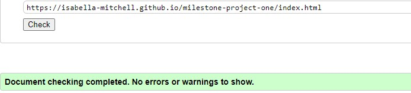
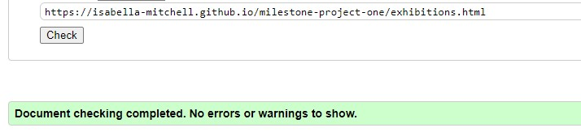
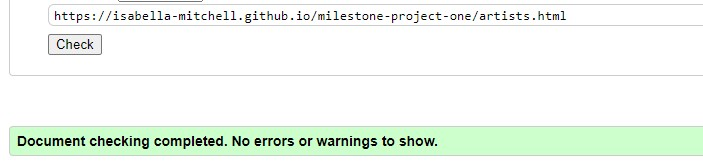
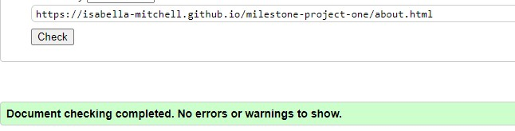
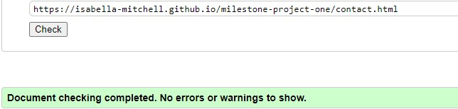
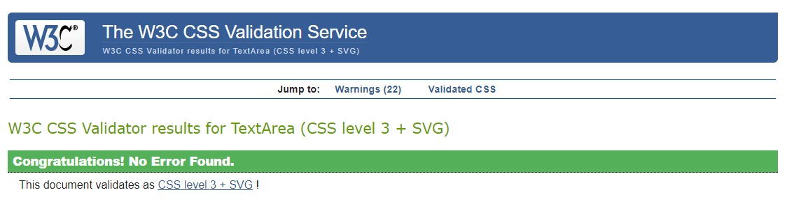
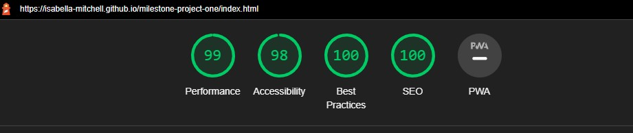
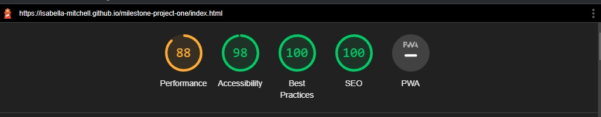
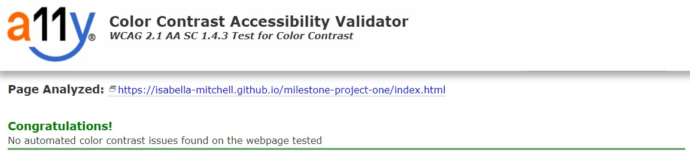

# Testing

The Row Gallery website has been tested using the following methods:
- [Code Validation](#code-validation)
    - [W3C HTML Validator](#w3c-html-validator) 
        - [Home Page](#home-page)
        - [Exhibitions Page](#exhibitions-page)
        - [Artists Page](#artists-page)
        - [About Page](#about-page)
        - [Contact Page](#contact-page)
    - [W3C CSS Validator](#w3c-css-validator)
- [Lighthouse](#lighthouse)
- [Responsiveness](#responsiveness)
- [A11y Color Contrast Accessibility Checker](#a11y-color-contrast-accessibility-checker)
- [Browser Compatibility](#browser-compatibility)
- [Testing User Stories](#testing-user-stories)
    - [Prospective Visitors](#prospective-visitors)
    - [Art Collectors](#art-collectors)
    - [Business Owners](#business-owners)
- [Peer Review](#peer-review)
- [Bugs](#bugs)
    - [Resolved](#resolved)
    - [Unresolved](#unresolved)

# Code Validation

## W3C HTML Validator

The Row Gallery website passed all tests using the W3C HTML Validator tool

### Home Page
<h2 align="center"></h2>

### Exhibitions Page
<h2 align="center"></h2>

### Artists Page
<h2 align="center"></h2>

### About Page
<h2 align="center"></h2>

### Contact Page
<h2 align="center"></h2>

## W3C CSS Validator

The Row Gallery website passed all tests using the W3C CSS Validator tool
<h2 align="center"></h2>

# Lighthouse

### Lighthouse Report for Homepage (Desktop)
<h2 align="center"></h2>

### Lighthouse Report for Homepage (Mobile)
<h2 align="center"></h2>

I used the Lighthouse reports in Google Developer Tools to examine the pages of the website for the following
- Performace
- Accessibility
- Best Practices 
- SEO

All Pages performed well (scored 97 and above) in:
- Performance, Accessibility, Best Practices and SEO on Desktop
- Accessibility, Best Practices and SEO on Mobile

Some Pages did not perform as well (scored 85 and above) in:
- Performance on mobile

Lighthouse recommends saving images in next-gen formats and eliminating render-blocking resources to improve performance on mobile. (Detailed in [Unresolved Bugs](#unresolved) section)

# A11y Color Contrast Accessibility Checker

All website pages were tested using the A11y Color Contrast Accessibility Checker and no automated colour contrast issues were found.

<h2 align="center"></h2>

# Browser Compatibility

The site was tested in Google Chrome, Microsoft Edge and Mozilla Firefox on desktop.

The site was tested in Google Chrome and Safari on mobile and tablet.

No issues arose during browser testing. CSS transitions worked on all browsers tested. 

Appearance, functionality and responsiveness were largely consistent across browsers and devices. Exceptions include:
- Image stretching on Ipad (see Resolved Bugs)
- The Lato font appearance changes quite a lot on mobile and iPad compared to desktop. I researched this and found this is a common experience. However, I am still happy with the font's appearance so I did not see the need to change the font.

# Responsiveness

Responsivity tests were carried out using Google Chrome DevTools. Device screen sizes covered include:
- iPhone SE
- iPhone XR
- iPhone 12 Pro
- Pixel 5
- Samsung Galaxy S8+
- Samsung Galaxy S20 Ultra
- iPad Mini
- iPad Air
- Surface Pro 7
- Surface Duo
- Galaxy Fold
- Samsung Galaxy A51/71
- Nest Hub
- Nest Hub Max

I also personally tested the website on iPhone 12, iPad Pro 2nd Generation, Dell XPS 15 laptop and a Dell widescreen monitor.

# Testing User Stories

## Prospective Visitors

- As a prospective visitor I would like to see what is currently on at the art gallery. 

    * On the homepage there is a section titled 'See What's On' with a button that the user can click to take them to the Exhibitions page.
    - There is also a link to the Exhibitions page on the navbar so users can navigate to it from any page.
    - Once on the Exhibitions page there are the names, descriptions, dates and images of the Exhibitions currently on.

-  As a prospective visitor I would like to see information to help me plan my visit to the gallery, including opening hours, location and directions.

    - On the homepage there is a section titled 'About’ with a button users can click to take them to the About page. This section features a brief description that signals that opening times and visiting information are on this page.
    - There is also a link to the About page on the navbar so users can navigate to it from any page.
    - Once on the About page the gallery opening times and location are clearly stated at the top of the page. There is an embedded Google Map with the gallery location pinned and written instructions about how to get to the gallery.
    - There are also buttons with links to the About page from the Exhibitions page titled 'Plan your visit'.

- As a prospective visitor I would like to see what amenities are nearby to the art gallery.

    - On the About page there is more information about where to eat, drink and stay near the gallery. The tone is friendly and inviting.
    - There are also buttons with links to the About page from the Exhibitions page.

- As a prospective visitor I would like to be able to contact the gallery if I have any questions about my visit.
    - On the homepage there is a section titled 'Get In Touch’ with a button users can click to take them to the Contact page. 
    - There is also a link to the Contact page on the navbar so users can navigate to it from any page.
    - Once on the Contact page there is a contact form that the user can use to contact the gallery. 
    - The Gallery’s email address and telephone number are also provided in the footer.

## Art Collectors 

- As an art collector I would like to see what artists are represented by the gallery, I would like to read information about them and see examples of their work. 

    - On the homepage there is a section titled ‘Artists’ with a button users can click to take them to the Artists page. 
    - There is also a link to the Artists page on the navbar so users can navigate to it from any page.
    - Once on the Artists page there are the names, bios and images of the Artists represented by the gallery.
    - There are buttons that link to each Artist’s Instagram, allowing the user to learn more about the Artist on an external site.

- As an art collector I would like to see information about the art gallery so that I know they are a respectable and trustworthy organisation. 

    - On the homepage there is a section titled 'About’ with a button users can click to take them to the About page. 
    - There is also a link to the About page on the navbar so users can navigate to it from any page.
    - Once on the About page there is information about the gallery, including information about how long they’ve been established and its mission and values. The tone is inclusive, polite and welcoming.
    - There are links to Row Gallery’s social media in their footer, allowing the user to learn more about the gallery on external websites.

- As an art collector I would like to be able to enquire about artworks for sale.

    - On the Artists page there are buttons titled 'Enquire about artworks" which link to the Contact page
    - There is also a link to the Contact page on the navbar so users can navigate to it from any page.
    - Once on the Contact page there is a contact form that the user can use to contact the gallery. 

- As an art collector I would like to be able to book a consultation either in person or virtually. 

    - On the About page there are buttons titled 'Book a Consultation" which link to the Contact page
    - There is also a link to the Contact page on the navbar so users can navigate to it from any page.
    - Once on the Contact page there is a contact form that the user can use to contact the gallery. There is the option to select a date and time when completing the form.

## Business Owners
     
* As the business owner, I want my website to be accessible and user-friendly on any device.

    - The website design is responsive so remains aesthetically pleasing and functional on all screen sizes. It features semantic HTML tags, screen reader tags and aria tags for accessibility. The pages also feature meta descriptions and alt-text which is beneficial for SEO.

* As the business owner, I want my website to feature external links to my social media channels.

    - There are links to social media channels in the footer bar, which appears on every page.

# Peer Review

In the final stages of the project, I submitted the site for Peer Review by fellow students and alumni at Code Institute via Slack. Feedback included adding more text to the Homepage sections and making the 'Back to Top' button visible on all screen sizes, not just smaller devices. Both of these points were resolved. 

I also asked a number of friends both inside and outside of the Code Institute community for feedback on my project. The feedback on the website and documentation was positive It was suggested that I add a 404.html page which I have.

It was also suggested that I could remove the Homepage link from the Navigation bar as the logo is linked back to the Homepage, and also give my Github Repository a name that is more reflective of the website name and purpose. I decided not to change these as it felt like too late in the project, but it is something I will remember for future projects.

# Bugs

## Resolved
- The Jumbotron image was not displaying fully on smaller screen sizes; only a portion of the image was showing. I used Google Chrome Dev Tools to identify that this was being caused by the background-attachment property being given a value of fixed. I removed this declaration and the image displayed how I wanted it to on smaller screen sizes.
- I went through several trial and error processes with the wave graphic. I initially attempted to make it using CSS. The best solution I found was creating this as a SVG file and using a z-index declaration to position this in front of the Jumbotron.
- The HTML validator flagged that there was an issue in the Footer, where a span was a direct child of a ul tag. I removed this and the code passed the validator.
- The HTML validator flagged that there was an issue with the naming of wave SVG, as there was a space in the name. I corrected this and the code passed the validator.
- When viewing the website on iPad I noticed the images on the homepage were being stretched. This was not happening on my desktop on Google Chrome Dev Tools. I found an article on [Stack Overflow](https://stackoverflow.com/questions/17430618/image-stretches-on-ipad-only) which suggested the problem could be by having applied a display: flex; property to the image. I removed this and the images displayed correctly. 

## Unresolved
- Improve Lighthouse Performance score on mobile by making changes including:
    - Serve images in next-gen formats (Image formats like WebP and AVIF often provide better compression than PNG or JPEG, which means faster downloads and less data consumption.)
    - Eliminate render-blocking resources (Resources are blocking the first paint of your page. Consider delivering critical JS/CSS inline and deferring all non-critical JS/styles)
- I noticed that videos do not load as thumbnails when viewed on the iPad, instead a play button shows and only when pressed does the thumbnail load.

Back to [README.md](/README.md#testing)